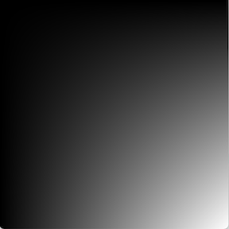

# atomshpericPlanet


An atomspheric like effect. This project started when I was interested in deciding the grayscale value of each pixel based on the x and y coordinates of each pixel. For example by multiplying x and y together. 
```processing 
 loadPixels();
  for(int x = 0; x < width; x++) {
    for(int y = 0; y < height; y++) {
         float value = x + y;
         pixels[width * y + x] = color(value);
    }
  }
  updatePixels();
```

The output will look like this:


In this case any product above 255 will result in white, even though the max value is 998 (width - 1 + height - 1). This can cause the output to look too bright, too fast, and this problem will only grow worse with faster growing functions. A solution is to map each function result to between 0 and the maximum value of the function.
```processing 
float maxValue = (width - 1) * (height - 1);
```
```processing 
float value = x * y;
float mappedValue = map(value, 0, maxValue, 0, 255);
pixels[width * y + x] = color(mappedValue);
```


Which will result in something like this:



Next we can divide the max value by dividing it by a integer divisor, which will cause the pixels to become brigther earlier
```processing
float mappedValue = map(value, 0, maxValue / divisor, 0, 255);
```
We can also modulate this divisor in order to create a pulsating effect. 


Finally, we can modify how we set to the pixels in order to make them reminiscient of a particular red, green, blue color scheme. 


